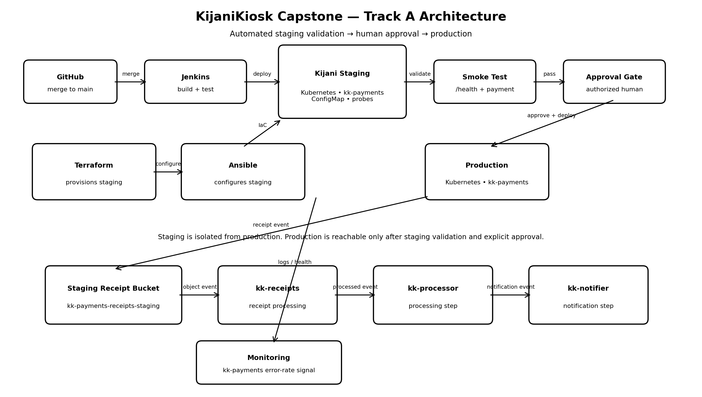

# KijaniKiosk Capstone

## 1. What Is This?

KijaniKiosk is a production-approaching DevOps delivery system for the `kk-payments` service. This capstone extends the existing application with an isolated Kubernetes staging environment, infrastructure managed through Terraform and Ansible, automated Jenkins delivery, staging smoke validation, human-controlled production approval, runtime monitoring, and an AWS S3/Lambda receipt-processing integration.

The main operational problem addressed by this capstone is the lack of a controlled multi-environment delivery path that validates application changes in staging before production promotion.

## 2. Architecture



The main components are:

- **Terraform:** Creates the `kijani-staging` Kubernetes namespace and staging AWS receipt infrastructure.
- **Ansible:** Applies and verifies the staging Kubernetes configuration.
- **Jenkins:** Builds, tests, packages, deploys to staging, runs the smoke test, requests human approval, and deploys to production.
- **Kubernetes:** Runs `kk-payments` with environment-specific configuration, health probes, and resource limits.
- **Monitoring:** Calculates the `kk-payments` payment error rate against a 5% threshold.
- **AWS S3:** Stores staging receipt events.
- **AWS Lambda:** Processes receipt events created in the staging receipt bucket.

## 3. Prerequisites

The following tools are required:

- Git
- Docker
- Minikube
- kubectl
- Terraform 1.5 or later
- Ansible
- AWS CLI with credentials capable of creating the staging S3 and Lambda resources
- Jenkins with Docker access
- A GitHub repository containing this project

Terraform requires Kubernetes access through the local kubeconfig and uses AWS region `eu-north-1`.

## 4. Setup

Clone the repository:

```bash
git clone https://github.com/Liz-Tabs/kijanikiosk-capstone.git
cd kijanikiosk-capstone
Start Minikube:

minikube start

Confirm Kubernetes access:

kubectl get nodes

Initialize and apply the staging Terraform configuration:

cd terraform/staging
terraform init
terraform plan
terraform apply

Return to the repository root:

cd ../..

Configure the staging environment with Ansible:

ansible-playbook \
  -i ansible/staging/inventory.ini \
  ansible/staging/configure-staging.yml

Verify the staging namespace:

kubectl get namespace kijani-staging

Verify the staging configuration:

kubectl get configmap kk-payments-config \
  -n kijani-staging \
  -o yaml
## 5. How to Run the Pipeline

The Jenkins pipeline is defined in Jenkinsfile.

Trigger the kijanikiosk-capstone Jenkins job from Jenkins.

The pipeline performs these stages:

Checkout source code.
Build and lint the application.
Run the application test command.
Build the Docker image.
Verify Kubernetes access.
Load the image into Minikube.
Deploy the application to kijani-staging.
Run the staging smoke test.
Request explicit human approval for production.
Deploy the application to production.
Report the final pipeline status.

Production deployment cannot continue until the approval gate is explicitly approved.

The approval step also records an approval reason in the Jenkins build output.

## 6. How to Verify It Works
Verify staging Pods
kubectl get pods -n kijani-staging

The kk-payments Pods should be Running and Ready.

Verify the health endpoint
kubectl run kk-payments-check \
  -n kijani-staging \
  --rm -i \
  --restart=Never \
  --image=curlimages/curl \
  -- \
  curl -fsS http://kk-payments/health

A successful response contains:

{
  "status": "healthy",
  "service": "kk-payments"
}
Verify staging configuration
kubectl get configmap kk-payments-config \
  -n kijani-staging \
  -o jsonpath='{.data.NODE_ENV}{"\n"}{.data.DB_HOST}{"\n"}{.data.DEFAULT_CURRENCY}{"\n"}'

Expected values include:

staging
staging-db
KES
Test a payment
kubectl exec -n kijani-staging deploy/prometheus -- \
  wget -qO- \
  --post-data='{"orderId":"verify-001","amount":1500,"currency":"KES"}' \
  --header='Content-Type: application/json' \
  http://kk-payments/payments
Check payment error rate

From the repository root:

./monitoring/check-payment-error-rate.sh

The monitoring script reports the number of payment attempts, errors, calculated error rate, and whether the rate exceeds the 5% threshold.

Verify production
kubectl get pods -n kijani-production
kubectl get deployment kk-payments -n kijani-production
kubectl rollout status deployment/kk-payments -n kijani-production
## 7. Known Limitations

This capstone is a production-approaching demonstration rather than a complete production platform.

The Kubernetes environment is based on a local Minikube cluster rather than a managed production Kubernetes service. The Docker image is loaded directly into Minikube instead of being promoted through a production container registry.

The monitoring implementation calculates the payment error rate from structured Kubernetes logs. It demonstrates the observability principle but does not provide the full alert-management, dashboarding, and incident-notification capabilities expected in a production monitoring platform.

The application currently has limited automated test coverage and requires additional unit and integration tests before handling real customer traffic.

The production deployment also uses the same local Kubernetes environment for demonstration purposes. A real deployment would require managed infrastructure, stronger secret management, TLS, centralized logging, production-grade monitoring, rollback automation, and additional security controls.

## Project Scope

This project follows Track A — Infrastructure-First.

The capstone focuses on controlled staging-to-production delivery, environment separation, monitoring, human approval, and integration with the existing receipt-processing infrastructure
